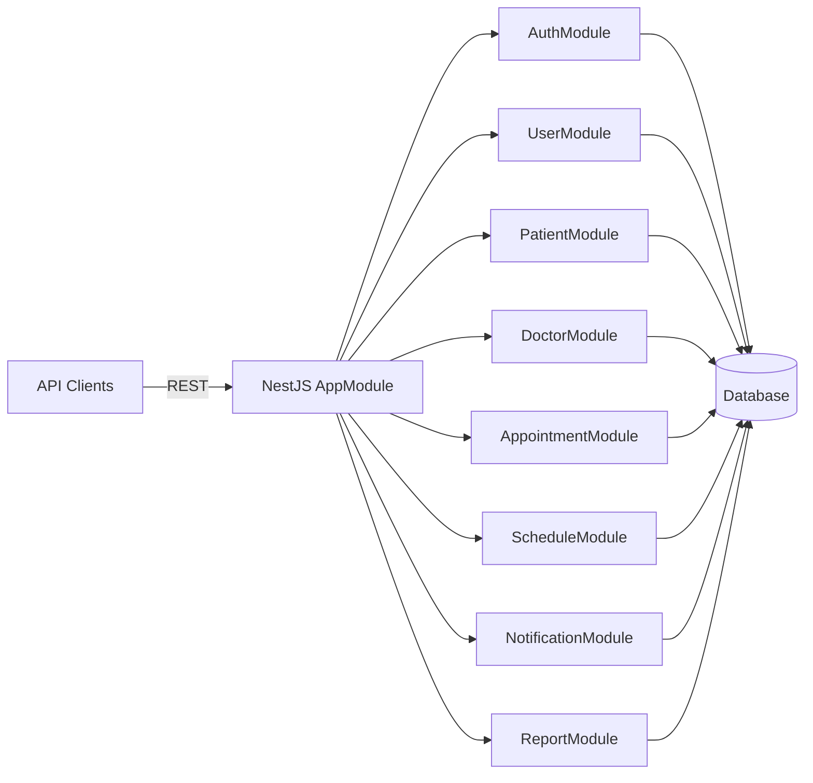

## Clinic Appointment System – Development Plan (NestJS Backend)

### 1. High-level architecture & tech choices

- **Backend**: NestJS (REST API), TypeScript.
- **Database**: PostgreSQL via TypeORM or Prisma (recommend PostgreSQL + Prisma for DX).
- **Auth**: JWT-based auth (access + refresh tokens), role-based authorization (Admin, Doctor, Patient).
- **Modules** (Nest): `auth`, `users`, `patients`, `doctors`, `appointments`, `schedules`, `notifications`, `reports` (last two can be basic at first).
- **Deployment target (later)**: `.env`-driven config, ready for Docker or simple VPS/host.

Mermaid overview of modules:

### 2. Project setup & core configuration

- **2.1. Initialize core Nest app**
  - Confirm `main.ts` uses `NestFactory` and enable global pipes (validation) and global exception filter later.
  - Configure environment variables (`config` module or `@nestjs/config`) with `.env` for DB URL, JWT secrets, etc.
- **2.2. Choose and wire ORM**
  - Install Prisma (recommended) or TypeORM.
  - For Prisma: define `schema.prisma` with `User`, `Patient`, `Doctor`, `Appointment`, `Schedule`, `Notification` models and generate client.
  - For TypeORM: configure in `app.module.ts` with entities and migrations.
- **2.3. Global validation & error handling**
  - Add `ValidationPipe` globally, with `whitelist` and `forbidNonWhitelisted`.
  - Add a simple global HTTP exception filter or rely on Nest defaults initially, refine later.

### 3. User & auth foundation (start here)

- **3.1. User model & roles**
  - Create `users` module with `User` entity/model: `id`, `email`, `passwordHash`, `role` (enum: ADMIN, DOCTOR, PATIENT), `createdAt`, `updatedAt`.
  - Implement `UsersService` for CRUD operations and user lookup by email.
- **3.2. Auth module**
  - Create `auth` module with:
    - `AuthService` for registration and login.
    - Password hashing with `bcrypt` (or `argon2`).
    - JWT generation: access token + refresh token; configurable expiry via env.
  - Implement controllers:
    - `POST /auth/register` (general or split `/register/patient` & `/register/doctor` controlled by Admin).
    - `POST /auth/login`.
    - `POST /auth/refresh`.
- **3.3. Guards & decorators**
  - Implement `JwtAuthGuard` for authenticated routes.
  - Implement `RolesGuard` plus `@Roles()` decorator for role-based access control.
  - Add `@CurrentUser()` decorator to inject user info from JWT.

### 4. Core domain models & basic CRUD

- **4.1. Patients & doctors modules**
  - `patients` module:
    - Model fields: `id`, `userId`, `fullName`, `dateOfBirth`, `phone`, `address`, optional `notes`.
    - Endpoints: create/update profile (patient + admin), get by id, search/list.
  - `doctors` module:
    - Model fields: `id`, `userId`, `fullName`, `specialty`, `bio`, `phone`, `room`, `isActive`.
    - Endpoints: create/update (admin only), list/search, get by id.
- **4.2. Schedules module**
  - Represent doctor availability: `id`, `doctorId`, `dayOfWeek`, `startTime`, `endTime`, `slotDurationMinutes`.
  - Endpoints for admin/doctor:
    - `POST /schedules` create schedule.
    - `GET /schedules/doctor/:id` view doctor schedule.
    - `PATCH /schedules/:id` update.

### 5. Appointment booking & management (core of the system)

- **5.1. Appointment model**
  - Fields: `id`, `patientId`, `doctorId`, `startTime`, `endTime`, `status` (PENDING, CONFIRMED, CANCELLED, COMPLETED), optional `reason`, `notes`.
- **5.2. Booking rules & service logic**
  - Implement `AppointmentsService` which:
    - Validates that requested time fits within doctor schedule.
    - Checks there is no overlapping appointment for the same doctor.
    - Applies simple business rules (e.g., cannot book in the past, max days in advance).
- **5.3. Appointment controller endpoints**
  - Patients:
    - `POST /appointments` to request/create appointment.
    - `GET /appointments/my` to list their own appointments.
    - `PATCH /appointments/:id/cancel` to cancel (with rules: can’t cancel too late).
  - Doctors:
    - `GET /appointments/doctor/my` to view their schedule.
    - `PATCH /appointments/:id/status` to confirm/complete.
  - Admin:
    - `GET /appointments` to list/search with filters (doctor, patient, date, status).

### 6. Notifications (basic implementation)

- **6.1. Notification model**
  - Fields: `id`, `userId`, `type` (EMAIL/SMS/IN_APP), `title`, `message`, `status` (PENDING, SENT, FAILED), `createdAt`.
- **6.2. Notification service**
  - Abstract interface (e.g. `NotificationService`) that supports `sendAppointmentCreated`, `sendAppointmentReminder`, `sendAppointmentStatusChanged`.
  - For now, implement simple email only, or even just log to console / DB for local dev; later plug in real providers (SendGrid, Twilio, etc.).
- **6.3. Trigger points**
  - Hook notifications into appointment events in `AppointmentsService` (on created, confirmed, cancelled).

### 7. Reporting (minimal to start)

- **7.1. Basic metrics endpoints**
  - For Admin only:
    - `GET /reports/appointments/summary?from=&to=`: total appointments, per status.
    - `GET /reports/doctors/workload?from=&to=`: appointments per doctor.
  - Implement as service methods using ORM aggregate queries.

### 8. Cross-cutting concerns (refinement phase)

- **8.1. DTOs & validation**
  - Create DTOs for all create/update endpoints using `class-validator` and `class-transformer`.
  - Ensure consistent error responses.
- **8.2. Logging & monitoring**
  - Use Nest’s `Logger` in critical services (auth, appointments, notifications).
  - Add request logging middleware if desired.
- **8.3. Security hardening**
  - Rate limiting on auth endpoints (e.g. Nest `@nestjs/throttler`).
  - Ensure passwords are always hashed and never logged.
  - Configure CORS appropriately for API-only backend.

### 9. Testing strategy

- **9.1 Unit tests**
  - Start with `AuthService`, `AppointmentsService`, and schedule logic.
  - Use Jest and mock repositories/Prisma client.
- **9.2 E2E tests**
  - Use Nest’s e2e testing setup in `test/` folder.
  - Cover flows: register + login, create patient/doctor, define schedule, create appointment, change status.

### 10. Development order (practical “what to do first”) 

1. **Set up ORM & config**: chose Prisma or TypeORM, set `.env`, connect to local PostgreSQL, run initial migration.
2. **Implement `users` + `auth` modules** with JWT, roles, guards.
3. **Implement `patients` and `doctors` modules** (models, services, controllers, basic CRUD).
4. **Implement `schedules` module** and expose endpoints to manage doctor availability.
5. **Implement `appointments` module** with booking rules and role-aware endpoints.
6. **Wire basic notifications** (even if it’s just logging) and hook into appointment lifecycle.
7. **Add basic reporting endpoints** using aggregates.
8. **Add tests for core flows**, refine validation, logging, and error handling.
9. **Prepare for deployment** (Dockerfile, production env vars) once stable.